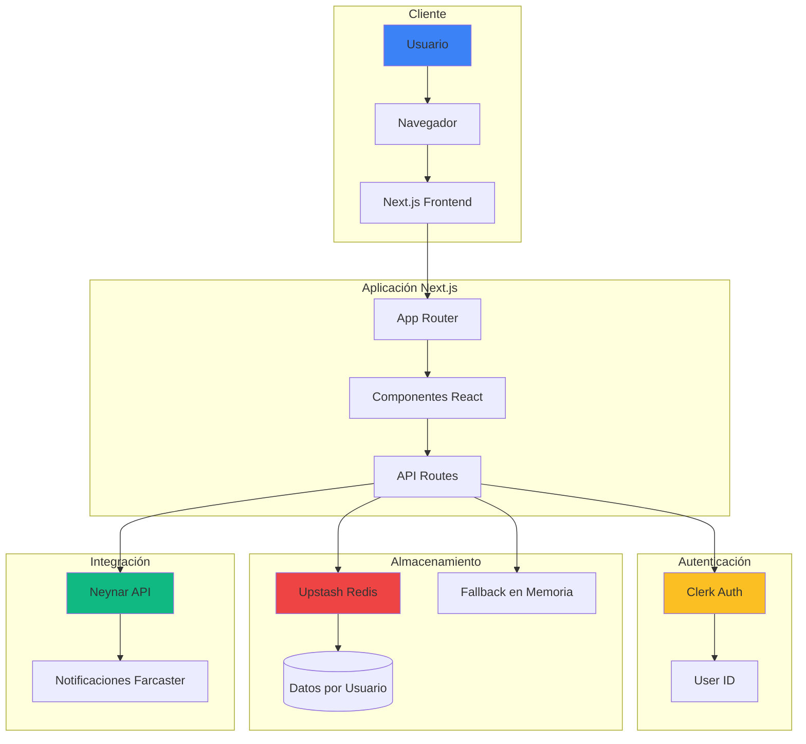
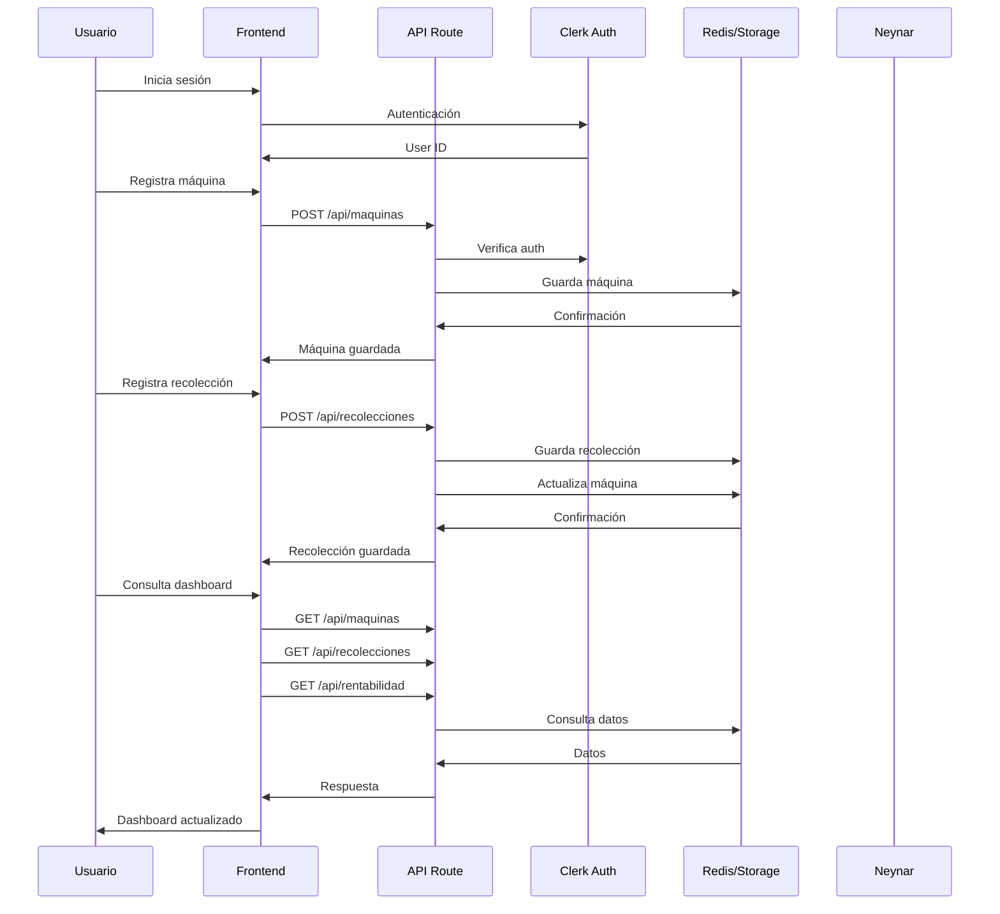
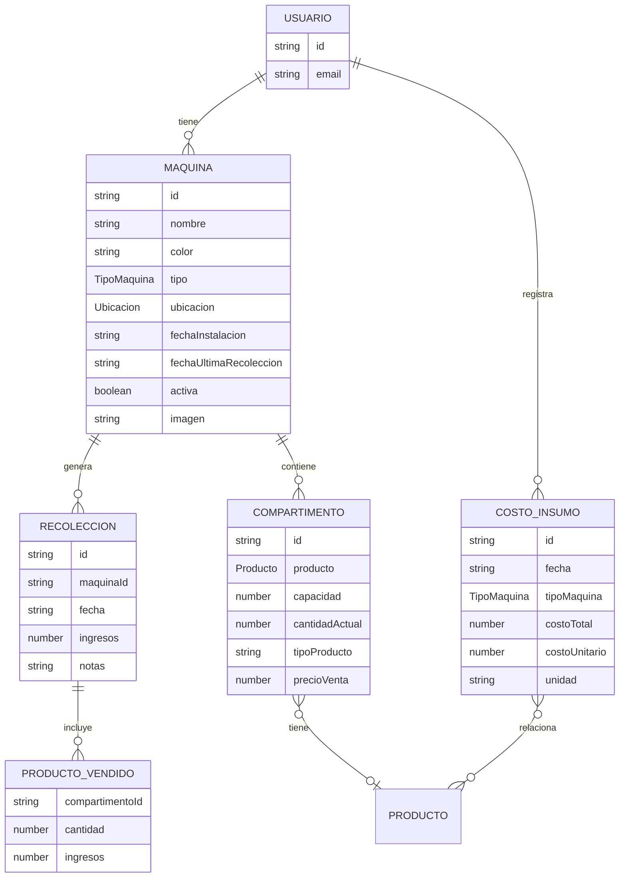
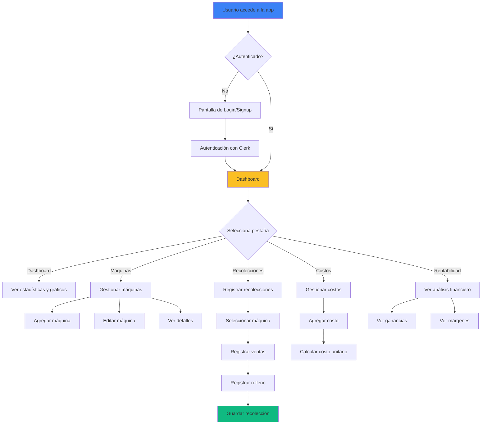
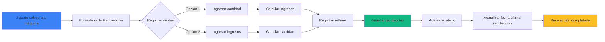

# 🎰 Gestión de Máquinas Vending

Sistema completo de gestión para negocios de máquinas vending (expendedoras). Permite registrar máquinas, controlar recolecciones, calcular rentabilidad, gestionar costos y recibir notificaciones automáticas.

## 📋 Tabla de Contenidos

- [Características](#-características)
- [Tecnologías](#-tecnologías)
- [Arquitectura](#-arquitectura)
- [Instalación](#-instalación)
- [Configuración](#-configuración)
- [Estructura del Proyecto](#-estructura-del-proyecto)
- [Uso de la Aplicación](#-uso-de-la-aplicación)
- [API Endpoints](#-api-endpoints)
- [Modelo de Datos](#-modelo-de-datos)
- [Despliegue](#-despliegue)
- [Contribuir](#-contribuir)

## ✨ Características

### 🎯 Funcionalidades Principales

- **📊 Dashboard Interactivo**
  - Estadísticas en tiempo real
  - Gráficos de ingresos (últimos 7 días)
  - Estado de máquinas con barras de progreso
  - Notificaciones de recolecciones pendientes

- **🏪 Gestión de Máquinas**
  - Registro de máquinas pelucheras y chicleras
  - Soporte para chicleras individuales, dobles y triples
  - Gestión de compartimentos y productos
  - Precio de venta por compartimento
  - Fotos de máquinas (almacenamiento base64)
  - Ubicación con integración de Google Maps

- **💰 Recolecciones**
  - Registro de ingresos por recolección
  - Cálculo automático de piezas vendidas (Ingresos / Precio)
  - Registro de relleno de productos
  - Fecha y hora personalizable
  - Historial completo de recolecciones
  - Filtrado por ubicación

- **📈 Rentabilidad**
  - Cálculo automático de ganancias
  - Análisis de costos por producto
  - Margen de ganancia por máquina
  - Reportes por período

- **💵 Gestión de Costos**
  - Registro de compras de insumos
  - Cálculo automático de costo unitario
  - Soporte para diferentes unidades (kg, cajas, bolsas)
  - Categorización por tipo de máquina

- **🔔 Notificaciones**
  - Alertas de recolecciones pendientes
  - Priorización por urgencia
  - Cálculo basado en última recolección

## 🛠 Tecnologías

### Frontend
- **Next.js 15** - Framework React con App Router
- **React 19** - Biblioteca UI
- **TypeScript** - Tipado estático
- **Tailwind CSS** - Estilos
- **Framer Motion** - Animaciones
- **Lucide React** - Iconos
- **Shadcn UI** - Componentes UI

### Backend
- **Next.js API Routes** - Endpoints REST
- **Zod** - Validación de esquemas
- **Upstash Redis** - Base de datos (con fallback en memoria)

### Autenticación
- **Clerk** - Autenticación de usuarios

### Integración Farcaster
- **Neynar SDK** - Integración con Farcaster
- **Farcaster Mini App SDK** - Funcionalidades de mini app

## 🏗 Arquitectura

### Diagrama de Arquitectura General



### Flujo de Datos



### Modelo de Datos



### Flujo de Usuario



## 📦 Instalación

### Prerrequisitos

- Node.js 18+ 
- npm, yarn o pnpm
- Cuenta en [Clerk](https://clerk.com) para autenticación
- Cuenta en [Upstash](https://upstash.com) para Redis (opcional)

### Pasos de Instalación

1. **Clonar el repositorio**
```bash
git clone https://github.com/MarxMad/Vending-Registro-Inventario-Costos.git
cd Vending-Registro-Inventario-Costos/vending-register
```

2. **Instalar dependencias**
```bash
npm install
# o
yarn install
# o
pnpm install
```

3. **Configurar variables de entorno**

Crea un archivo `.env.local` en la raíz del proyecto:

```env
# Clerk Authentication
NEXT_PUBLIC_CLERK_PUBLISHABLE_KEY=pk_test_...
CLERK_SECRET_KEY=sk_test_...

# Upstash Redis (Opcional - si no se configura, usa almacenamiento en memoria)
KV_REST_API_URL=https://tu-redis.upstash.io
KV_REST_API_TOKEN=tu-token-aqui

# Neynar (Opcional - para integración Farcaster)
NEYNAR_API_KEY=tu-api-key
NEYNAR_CLIENT_ID=tu-client-id

# App Configuration
NEXT_PUBLIC_URL=http://localhost:3000
```

4. **Ejecutar en desarrollo**
```bash
npm run dev
```

La aplicación estará disponible en `http://localhost:3000`

## ⚙️ Configuración

### Variables de Entorno Requeridas

| Variable | Descripción | Requerido |
|----------|-------------|-----------|
| `NEXT_PUBLIC_CLERK_PUBLISHABLE_KEY` | Clave pública de Clerk | ✅ Sí |
| `CLERK_SECRET_KEY` | Clave secreta de Clerk | ✅ Sí |
| `KV_REST_API_URL` | URL de Upstash Redis | ⚠️ Opcional |
| `KV_REST_API_TOKEN` | Token de Upstash Redis | ⚠️ Opcional |
| `NEXT_PUBLIC_URL` | URL base de la aplicación | ✅ Sí |

### Configuración de Clerk

1. Crea una cuenta en [Clerk](https://clerk.com)
2. Crea una nueva aplicación
3. Copia las claves de API desde el dashboard
4. Agrega las claves a `.env.local`

### Configuración de Upstash Redis

1. Crea una cuenta en [Upstash](https://upstash.com)
2. Crea una nueva base de datos Redis
3. Copia la URL REST y el token
4. Agrega las credenciales a `.env.local`

**Nota:** Si no configuras Redis, la aplicación usará almacenamiento en memoria (los datos se perderán al reiniciar el servidor).

## 📁 Estructura del Proyecto

```
vending-register/
├── src/
│   ├── app/                    # Next.js App Router
│   │   ├── api/               # API Routes
│   │   │   ├── maquinas/      # CRUD de máquinas
│   │   │   ├── recolecciones/ # CRUD de recolecciones
│   │   │   ├── costos/        # CRUD de costos
│   │   │   ├── rentabilidad/  # Cálculo de rentabilidad
│   │   │   └── notificaciones-recoleccion/
│   │   ├── layout.tsx         # Layout principal
│   │   ├── page.tsx           # Página principal
│   │   └── providers.tsx      # Providers de contexto
│   │
│   ├── components/            # Componentes React
│   │   ├── App.tsx           # Componente principal
│   │   ├── auth/             # Autenticación
│   │   ├── ui/               # Componentes UI reutilizables
│   │   └── vending/          # Componentes de negocio
│   │       ├── Dashboard.tsx
│   │       ├── MaquinasList.tsx
│   │       ├── MaquinaFormMejorado.tsx
│   │       ├── RecoleccionForm.tsx
│   │       ├── CostosTab.tsx
│   │       └── RentabilidadView.tsx
│   │
│   ├── lib/                  # Utilidades y lógica
│   │   ├── types.ts          # Tipos TypeScript
│   │   ├── vendingStorage.ts # Lógica de almacenamiento
│   │   ├── constants.ts      # Constantes
│   │   └── utils.ts          # Utilidades
│   │
│   └── middleware.ts         # Middleware de Clerk
│
├── public/                   # Archivos estáticos
│   ├── VendingLogo3D.png    # Logo
│   └── manifest.json         # PWA manifest
│
├── .env.local               # Variables de entorno (no commitear)
├── package.json             # Dependencias
├── tailwind.config.ts       # Configuración Tailwind
└── README.md               # Este archivo
```

## 🎮 Uso de la Aplicación

### 1. Inicio de Sesión

Al acceder a la aplicación, verás la pantalla de login. Puedes:
- Iniciar sesión con una cuenta existente
- Crear una nueva cuenta

### 2. Dashboard

El dashboard muestra:
- **Total de máquinas** registradas
- **Ingresos del mes** actual
- **Gráfico de ingresos** últimos 7 días
- **Estado de máquinas** con barras de progreso
- **Próximas recolecciones** ordenadas por prioridad

### 3. Registrar Máquinas

1. Ve a la pestaña **"Máquinas"**
2. Haz clic en **"Agregar Máquina"**
3. Completa el formulario:
   - Nombre y color
   - Tipo (Peluchera o Chiclera)
   - Si es chiclera: individual, doble o triple
   - Productos y precio de venta por compartimento
   - Ubicación (con Google Maps opcional)
   - Foto de la máquina
4. Guarda la máquina

### 4. Registrar Recolecciones

1. Ve a la pestaña **"Recolecciones"**
2. Selecciona una máquina de la lista
3. Completa el formulario:
   - **Fecha y hora** (puedes ajustarla)
   - **Productos vendidos**: 
     - Opción 1: Ingresar cantidad → calcula ingresos
     - Opción 2: Ingresar ingresos → calcula cantidad automáticamente
   - **Relleno de productos**: registra cuánto rellenaste
4. Guarda la recolección

### 5. Gestionar Costos

1. Ve a la pestaña **"Costos"**
2. Haz clic en **"Agregar Costo"**
3. Completa:
   - Tipo de máquina (peluchera/chiclera)
   - Concepto y cantidad
   - Unidad (kg, cajas, bolsas, etc.)
   - Costo total
   - Campos adicionales según la unidad (unidades por kg, etc.)
4. El sistema calcula automáticamente el costo unitario

### 6. Ver Rentabilidad

1. Ve a la pestaña **"Rentabilidad"**
2. Selecciona una máquina
3. Visualiza:
   - Ingresos totales
   - Costos totales
   - Ganancia neta
   - Margen de ganancia

## 🔌 API Endpoints

### Máquinas

```typescript
GET    /api/maquinas              // Obtener todas las máquinas del usuario
POST   /api/maquinas              // Crear nueva máquina
PUT    /api/maquinas              // Actualizar máquina existente
DELETE /api/maquinas?maquinaId=   // Eliminar máquina
```

### Recolecciones

```typescript
GET    /api/recolecciones                    // Obtener todas las recolecciones
GET    /api/recolecciones?maquinaId=         // Obtener recolecciones de una máquina
POST   /api/recolecciones                   // Crear nueva recolección
```

### Costos

```typescript
GET    /api/costos              // Obtener todos los costos del usuario
POST   /api/costos              // Crear nuevo costo
```

### Rentabilidad

```typescript
GET    /api/rentabilidad?maquinaId=         // Calcular rentabilidad de una máquina
GET    /api/rentabilidad                    // Calcular rentabilidad general
```

### Notificaciones

```typescript
GET    /api/notificaciones-recoleccion      // Obtener notificaciones de recolección
```

## 💾 Modelo de Datos

### Tipos Principales

```typescript
// Máquina
interface Maquina {
  id: string;
  nombre: string;
  color: string;
  tipo: 'peluchera' | 'chiclera';
  tipoChiclera?: 'individual' | 'doble' | 'triple';
  ubicacion: Ubicacion;
  compartimentos: Compartimento[];
  fechaInstalacion: string;
  fechaUltimaRecoleccion: string | null;
  diasRecoleccionEstimados: number;
  activa: boolean;
  imagen?: string; // base64
}

// Compartimento
interface Compartimento {
  id: string;
  producto: Producto | null;
  capacidad: number;
  cantidadActual: number;
  tipoProducto?: string;
  precioVenta?: number;
}

// Recolección
interface Recoleccion {
  id: string;
  maquinaId: string;
  fecha: string; // ISO
  ingresos: number;
  productosVendidos: ProductoVendido[];
  notas?: string;
}

// Costo
interface CostoInsumo {
  id: string;
  fecha: string;
  tipoMaquina: 'peluchera' | 'chiclera';
  concepto: string;
  cantidad: number;
  unidad: string;
  costoTotal: number;
  costoUnitario: number;
}
```

## 🚀 Despliegue

### Despliegue en Vercel

1. **Conectar repositorio**
   - Ve a [Vercel](https://vercel.com)
   - Importa tu repositorio de GitHub

2. **Configurar variables de entorno**
   - En el dashboard de Vercel, ve a Settings → Environment Variables
   - Agrega todas las variables de `.env.local`

3. **Desplegar**
   - Vercel detectará automáticamente Next.js
   - El despliegue se iniciará automáticamente

### Variables de Entorno en Vercel

Asegúrate de configurar:
- `NEXT_PUBLIC_CLERK_PUBLISHABLE_KEY`
- `CLERK_SECRET_KEY`
- `KV_REST_API_URL` (si usas Redis)
- `KV_REST_API_TOKEN` (si usas Redis)
- `NEXT_PUBLIC_URL` (URL de producción)

## 📊 Diagrama de Flujo de Recolección



## 🔐 Seguridad

- **Autenticación**: Clerk maneja la autenticación de usuarios
- **Autorización**: Cada usuario solo puede acceder a sus propios datos
- **Validación**: Zod valida todos los datos de entrada
- **Almacenamiento**: Datos separados por `userId` en Redis

## 🤝 Contribuir

Las contribuciones son bienvenidas. Por favor:

1. Fork el proyecto
2. Crea una rama para tu feature (`git checkout -b feature/AmazingFeature`)
3. Commit tus cambios (`git commit -m 'Add some AmazingFeature'`)
4. Push a la rama (`git push origin feature/AmazingFeature`)
5. Abre un Pull Request

## 📝 Licencia

Este proyecto está bajo la Licencia MIT.

## 👤 Autor

**MarxMad**

- GitHub: [@MarxMad](https://github.com/MarxMad)
- Repositorio: [Vending-Registro-Inventario-Costos](https://github.com/MarxMad/Vending-Registro-Inventario-Costos)

## 🙏 Agradecimientos

- [Neynar](https://neynar.com) - SDK de Farcaster
- [Clerk](https://clerk.com) - Autenticación
- [Upstash](https://upstash.com) - Redis
- [Next.js](https://nextjs.org) - Framework
- [Framer Motion](https://www.framer.com/motion/) - Animaciones

---

⭐ Si este proyecto te resulta útil, considera darle una estrella en GitHub!
